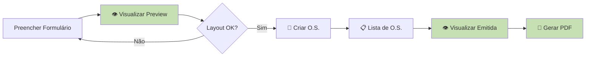

# 🎨 Alinhamento de Layout: Visualização ≡ PDF

## Objetivo

Garantir que a **pré-visualização** (modal) e a **visualização de O.S. emitida** tenham o **mesmo layout** do **PDF gerado**, incluindo:
- ✅ Mesmas 8 colunas
- ✅ Cores verde claro (#c6e0b4 e #e2efd9)
- ✅ Mesma ordem de colunas
- ✅ Formatação de números idêntica

---

## Estrutura dos Dados

### Campo `diarias` está CORRETO ✅

**Localização:** Tabela `itens_ordem_servico` (NÃO na `ordens_servico`)

```python
# backend/models.py - Linha 175
class ItemOrdemServico(db.Model):
    """Itens utilizados em cada Ordem de Serviço"""
    __tablename__ = 'itens_ordem_servico'
    
    id = db.Column(db.Integer, primary_key=True)
    ordem_servico_id = db.Column(db.Integer, db.ForeignKey('ordens_servico.id'))
    
    # Campos relacionados a diárias
    diarias = db.Column(db.Integer, default=1)  # ✅ Multiplicador
    quantidade_solicitada = db.Column(db.Float)  # ✅ Qtd por diária
    quantidade_total = db.Column(db.Float)       # ✅ Total (diarias × qtd_sol)
```

**Conceito:**
- Cada **ITEM** da O.S. tem suas próprias **diárias**
- Uma O.S. pode ter itens com diárias diferentes:
  - Item 1: 3 diárias de 60 unidades = 180 total
  - Item 2: 2 diárias de 100 unidades = 200 total
  - Item 3: 1 diária de 50 unidades = 50 total

---

## Atualização do Layout

### 📋 Tabela com 8 Colunas (Igual ao PDF)

| Coluna | Largura | Alinhamento | Exemplo |
|--------|---------|-------------|---------|
| **Nº** | 5% | Centro | 1 |
| **DESCRIÇÃO** | 25% | Esquerda | Água mineral em copos de 200 ml |
| **ITEM BEC** | 10% | Centro | 339030 |
| **DIÁRIAS** | 8% | Centro | 3 |
| **QTDE SOLICITADA** | 10% | Direita | 60 |
| **QTDE SOLICITADA TOTAL** | 12% | Direita | 180 |
| **VALOR UNIT.** | 15% | Direita | R$ 25,60 |
| **VALOR TOTAL** | 15% | Direita | R$ 4.608,00 |

---

### 🎨 Cores (Igual ao PDF)

```css
/* Cabeçalho e Rodapé */
background-color: #c6e0b4;  /* Verde claro */

/* Linhas de dados */
background-color: #e2efd9;  /* Verde muito claro */
```

---

## Código Atualizado

### ✅ Função `gerarPreviewOS()` - app.js (linha ~662)

```javascript
<div class="os-section">
    <table class="os-items-table">
        <thead>
            <tr style="background-color: #c6e0b4;">
                <th style="width: 5%;">Nº</th>
                <th style="width: 25%;">DESCRIÇÃO</th>
                <th style="width: 10%;">ITEM BEC</th>
                <th style="width: 8%;">DIÁRIAS</th>
                <th style="width: 10%;">QTDE<br/>SOLICITADA</th>
                <th style="width: 12%;">QTDE<br/>SOLICITADA<br/>TOTAL</th>
                <th style="width: 15%;">VALOR UNIT.</th>
                <th style="width: 15%;">VALOR<br/>TOTAL</th>
            </tr>
        </thead>
        <tbody>
            ${dados.itens.map(item => {
                const diarias = item.diarias || 1;
                const qtdSolicitada = item.qtdSolicitada || (item.qtdTotal / diarias);
                const qtdTotal = item.qtdTotal;
                const valorTotal = item.valorUnit * qtdTotal;
                
                // Formatar com separador de milhares pt-BR
                const qtdSolFmt = qtdSolicitada.toLocaleString('pt-BR', {
                    minimumFractionDigits: 0, 
                    maximumFractionDigits: 0
                });
                const qtdTotalFmt = qtdTotal.toLocaleString('pt-BR', {
                    minimumFractionDigits: 0, 
                    maximumFractionDigits: 0
                });
                const valorTotalFmt = valorTotal.toLocaleString('pt-BR', {
                    minimumFractionDigits: 2, 
                    maximumFractionDigits: 2
                });
                
                return `
                <tr style="background-color: #e2efd9;">
                    <td style="text-align: center;">${item.num}</td>
                    <td style="text-align: left; padding-left: 8px;">${item.descricao}</td>
                    <td style="text-align: center;">${item.itemBec}</td>
                    <td style="text-align: center;">${diarias}</td>
                    <td style="text-align: right; padding-right: 8px;">${qtdSolFmt}</td>
                    <td style="text-align: right; padding-right: 8px;">${qtdTotalFmt}</td>
                    <td style="text-align: right; padding-right: 8px;">R$ ${item.valorUnit.toFixed(2).replace('.', ',')}</td>
                    <td style="text-align: right; padding-right: 8px;">R$ ${valorTotalFmt}</td>
                </tr>
                `}).join('')}
        </tbody>
        <tfoot>
            <tr style="background-color: #c6e0b4;">
                <td colspan="7" style="text-align: right; padding-right: 8px;">
                    <strong>VALOR TOTAL:</strong>
                </td>
                <td style="text-align: right; padding-right: 8px;">
                    <strong>R$ ${valorTotal.toLocaleString('pt-BR', {
                        minimumFractionDigits: 2, 
                        maximumFractionDigits: 2
                    })}</strong>
                </td>
            </tr>
        </tfoot>
    </table>
</div>
```

---

## Formatação de Números

### JavaScript (Visualização)

```javascript
// Quantidade com separador de milhares
const qtdFmt = qtd.toLocaleString('pt-BR', {
    minimumFractionDigits: 0,
    maximumFractionDigits: 0
});
// Resultado: "2.000" (com ponto)

// Valor monetário
const valorFmt = valor.toLocaleString('pt-BR', {
    minimumFractionDigits: 2,
    maximumFractionDigits: 2
});
// Resultado: "4.608,00" (ponto para milhares, vírgula para decimais)

// Valor unitário simples
const valorUnit = valor.toFixed(2).replace('.', ',');
// Resultado: "25,60"
```

### Python (PDF)

```python
# Quantidade com separador de milhares
qtd_fmt = f"{qtd:,.0f}".replace(',', '.')
# Resultado: "2.000"

# Valor monetário
valor_fmt = f'R$ {valor:,.2f}'.replace(',', 'X').replace('.', ',').replace('X', '.')
# Resultado: "R$ 4.608,00"
```

---

## Comparação: Antes vs Depois

### ❌ ANTES (7 colunas, sem cores)

```
┌────┬──────────┬─────────────┬─────────┬─────┬────────────┬───────────┐
│ Nº │ ITEM BEC │ DESCRIÇÃO   │ UNIDADE │ QTD │ VALOR UNIT │ TOTAL     │
├────┼──────────┼─────────────┼─────────┼─────┼────────────┼───────────┤
│ 1  │ 339030   │ Água...     │ UND     │ 180 │ R$ 25.60   │ R$ 4608.00│
└────┴──────────┴─────────────┴─────────┴─────┴────────────┴───────────┘
```

**Problemas:**
- ❌ Mostrava qtdTotal (180) ao invés de qtdSolicitada (60)
- ❌ Não mostrava diárias (3)
- ❌ Ordem errada (ITEM BEC antes de DESCRIÇÃO)
- ❌ Sem cores verde
- ❌ Formatação de números inconsistente

---

### ✅ DEPOIS (8 colunas, cores verde, igual ao PDF)

```
┌────┬──────────────┬──────────┬─────────┬──────────┬──────────┬────────────┬───────────┐
│ Nº │ DESCRIÇÃO    │ ITEM BEC │ DIÁRIAS │ QTDE SOL │ QTDE TOT │ VALOR UNIT │ VALOR TOT │
├────┼──────────────┼──────────┼─────────┼──────────┼──────────┼────────────┼───────────┤
│ 1  │ Água...      │ 339030   │    3    │      60  │     180  │  R$ 25,60  │R$ 4.608,00│
└────┴──────────────┴──────────┴─────────┴──────────┴──────────┴────────────┴───────────┘
         Verde muito claro (#e2efd9)
```

**Melhorias:**
- ✅ Mostra diárias (3)
- ✅ Mostra qtdSolicitada (60) - quantidade por dia
- ✅ Mostra qtdTotal (180) - total geral
- ✅ Ordem correta (DESCRIÇÃO antes de ITEM BEC)
- ✅ Cores verde claro (#c6e0b4 e #e2efd9)
- ✅ Formatação brasileira (2.000 e R$ 4.608,00)
- ✅ **Layout idêntico ao PDF!**

---

## Arquivos Modificados

```
backend/
  └── static/
      └── js/
          └── app.js ✅ (função gerarPreviewOS)

app.js ✅ (raiz - função gerarPreviewOS)
```

---

## Como Testar

### 1. Pré-visualização (Antes de Criar)

1. Vá em **📄 Emitir O.S.**
2. Preencha os dados e adicione item:
   - Diárias: 3
   - Quantidade: 60
3. Clique **👁️ Visualizar O.S.**
4. **Verifique:**
   - ✅ Tabela com 8 colunas
   - ✅ Cores verde claro
   - ✅ DIÁRIAS: 3
   - ✅ QTDE SOLICITADA: 60
   - ✅ QTDE SOLICITADA TOTAL: 180

### 2. Visualização de O.S. Emitida

1. Vá em **📋 Ordens de Serviço**
2. Clique **👁️ Visualizar** em qualquer O.S.
3. **Verifique:**
   - ✅ Mesmo layout da pré-visualização
   - ✅ Mesmas cores verde
   - ✅ Mesmas 8 colunas
   - ✅ Valores corretos

### 3. Comparar com PDF

1. Gere o PDF da mesma O.S. (**📄 PDF**)
2. **Compare:**
   - ✅ Cabeçalhos idênticos
   - ✅ Cores idênticas
   - ✅ Valores idênticos
   - ✅ Formatação idêntica

---

## Fluxo Completo



**Todos os 3 pontos têm layout IDÊNTICO:** ✅
1. Preview antes de criar
2. Visualização da O.S. emitida
3. PDF gerado

---

## Status

✅ **ALINHAMENTO COMPLETO!**

- [x] Tabela de pré-visualização com 8 colunas
- [x] Cores verde claro (#c6e0b4 e #e2efd9)
- [x] Ordem de colunas igual ao PDF
- [x] Formatação de números brasileira
- [x] Campo `diarias` na tabela correta (itens_ordem_servico)
- [x] Cálculo correto: diarias × qtdSolicitada = qtdTotal
- [x] Layout idêntico em preview, visualização e PDF

**Teste agora:**
1. Ctrl+Shift+R para recarregar
2. Crie uma O.S. e visualize
3. Compare com o PDF
4. **Tudo deve estar IGUAL!** 🎉
